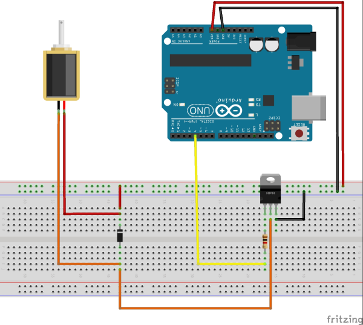
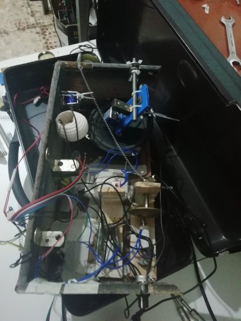
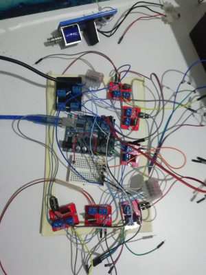
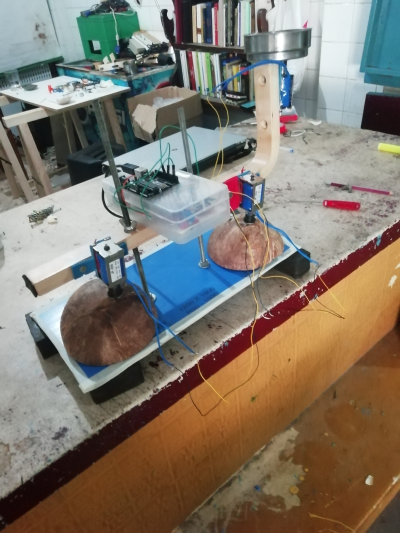
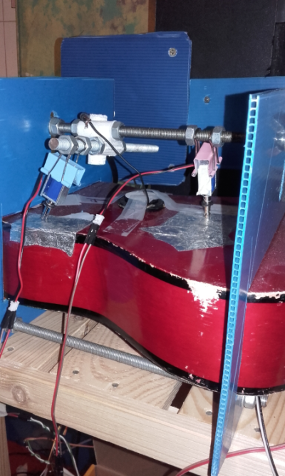
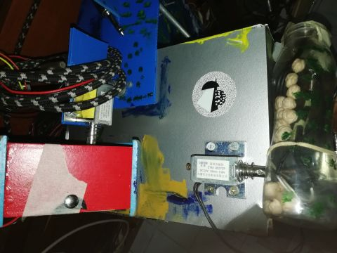

# RITMOLÓN
Sobre el instrumento de percusión robótica y secuenciador de ritmos

## INTRO

El ritmolon es un secuenciador de ritmos que utiliza solenoides para golpear pequeños objetos, haciendo un ritmo o compás. A menudo estos objetos llevan adheridos unos micrófonos de contacto (piezo-electricos) así que la señal acústica se puede amplificar (o procesar) en la ejecución del ritmo.

Es un proyecto hecho con **ARDUINO**. 

Es fácil ejecutar ritmos "impares" o compuestos o simplemente en (por ejemplo) 17 tiempos. Cosa que en un secuenciador al uso simplemente no se puede. Si estás harto de que el número 4 te subyugue (cosa normal. También es muy tiránico el número 3) ésta puede ser una buena opción.  

La forma de funcionar puede verse aquí:

# HOW TO

Esto, como casi todo, tiene una parte física y otra metafísica

## LA MATERIA

Las partes son:

- Arduino Uno.............................(x1)  
- Módulo de Controlador MOSFET IRF520.....(x3)  
- Cables Dupont...........................(x1)  
- Piezo transductor (3 en 1)..............(x1)  
- solenoide Tipo de empujar tirar.........(X3)  

Tambien se necesitan objetos a golpear: madera, metal, una botella, la cajita-pastillero que ya no usas, una tapa de bote, un jarrillo de lata.....

El diagrama de conexión es el que se muestra a continuación. Si tiene dudas usa el buscador, porque conectar y hacer funcionar un solenoide es más sencillo que coger un cubo por el asa.

En nuestro caso (el código) los solenoides están conectados a Digital PIN 2, 7 y 9.

Puedes cambiar esta parte en el archivo *c_tema.h* para modificar éstos pines, si lo deseas:
~~~
const int sol_1 = 9;    // solenoide 1    
const int sol_2 = 7;    // solenoide 2
const int sol_3 = 2;    // solenoide 3
~~~

## LA FORMA

El código está en el [directorio src](src)

Descárgalo y súbelo al arduino con los solenoides conectados. En este ejemplo, una vez corriendo el código, se le envían las órdenes a través de *Monitor Serial*.

En el teclado:

 - 1, 2, 3, 4    Son los temas 1, 2, 3, 4  
 - para cada tema: a, s, d, f   realiza una variante ó capa del ritmo  

## ALGUNAS MUESTRAS

La música que suelo realizar basándome en alguna de los varias implementaciones que tengo de éste cacharro:

https://vandermamasso.bandcamp.com/

https://post4.bandcamp.com/

https://brunelevsky.bandcamp.com/

He aquí algunas fotos 

Aquí dejo enlazada otro vídeo de cómo suena

Más fotos:

