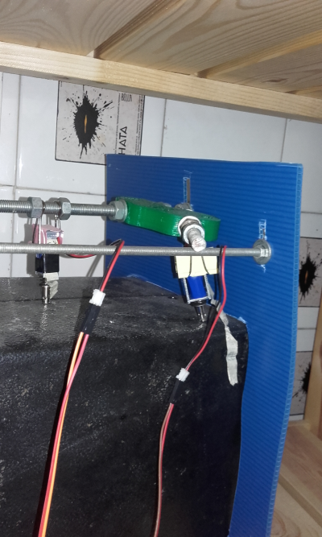
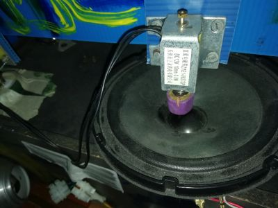

# ritmolon
Sobre el instrumento de percusión robótica y secuenciador de ritmos

## INTRO

El ritmolón es un secuenciador de ritmos y sonidos (pero fundamentalmente golpes rítmicos)

Se usa una placa arduino.
Se conectan solenoides.

Los solenoides suelen golpear objetos físicos: 
* altavoces
* latas, chapas metálicas
* una botella
* piezas de madera....

Estos objetos van provistos de piezoeléctrico. Así que se recoge el sonido de cada golpe individualmente. Se mezclan en una mesa. Y ya tenemos nuestro secuenciador rítmico.

He aquí algunas fotos 

Aquí dejo enlazada otra muestra de cómo suena

## MATERIA

Anteriormente dijimos que el ritmolon son solenoides que golpean objetos que se amplifican. 

La conexión de una solenoide es:

Y vamos a suponer que tenemos 3 de estos solenoides, que vamos a llamar 

+ sol_k1 = Es el Kick del Rimolón
+ sol_g1 = el grave
+ sol_a1 = el agudo

Que se corresponden al tipo de sonido que obtenemos cuando el solenoide golpea el objeto en cuestión. Por ejemplo esto sería una muestra:

Para montar el ritmolón necesitamos tener las siguientes cosillas. 
La **PART LIST** es:

1. Arduino
2. Cables y alicates. 
3. Soldador y estaño
4. diodos (valdría el 1N4004 diode, también el 1N4001...) (x3)
5. Módulo de Controlador MOSFET IRF520 (x3)
	https://www.amazon.es/dp/B07191NYQH/ref=pe_3310721_185740151_TE_item
6. Electroimán para solenoide de movimiento lineal (12 V, 0 9V) (x3)+
7. Piezo transductor, Micrófono Contacto 3 en 1 & Endpin Jack 6mm
	https://www.amazon.es/dp/B073ZDQ416/ref=pe_3310721_189395781_TE_SCE_dp_1

La forma de montar esto es obvia. Solo es necesario soldar el diodo entre ambos cables del solenoide. Y conectarlo al modulo IRF.
Posteriormente conectar el modulo al arduino. 

## FORMA

Subimos a través del IDE de arduino a la placa de el ritmolón ...

y sacamos el <i>Monitor Serial</i>

